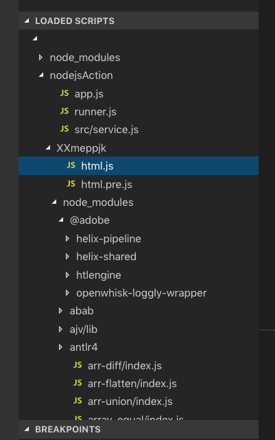

# Debug OpenWhisk action

While it's not possible to debug actions deployed in the cloud we can emulate the OpenWhisk runtime environment by running the same Docker image as used in the cloud locally.

## 0. Pre-Requisites

You'll need [Docker](https://www.docker.com/) installed on your local machine. You'll also need a properly set-up Helix development environment, see [Getting Started](https://github.com/adobe/helix-home/blob/master/getting-started.md) for instructions.

### Install utilities

To install [HTTPie](https://httpie.org/) and [jq](https://stedolan.github.io/jq/) on a Mac:

```bash
brew install httpie jq
```

## 1. Start OpenWhisk Node.js action runtime container

```bash
docker run -p 8080:8080 -p 9229:9229 -it adobeapiplatform/adobe-action-nodejs-v10:3.0.17 node --inspect=0.0.0.0:9229 app.js
```

## 2. Build .zip archive of action

In your project directory:

```bash
# create action zip file (will generete .hlx/build/html.zip)
hlx deploy --dry-run
```

## <a name="3_deploy"></a>3. Deploy action locally

```bash
cd .hlx/build
# create json file with Base64 encoded action zip file content
base64 html.zip | tr -d '\n' | jq -sR '{value: {main: "main", binary: true, code: .}}' > html.json
# deploy the action to the Node.js runtime in your docker container
http post localhost:8080/init < html.json
```

## 4. Connect VSCode Debugger to the action runtime container

Launch VSCode, switch to Debug View, add the following launch configuration:

```json
{
    "type": "node",
    "request": "attach",
    "name": "Attach to OpenWhisk docker",
    "address": "127.0.0.1",
    "port": 9229
}
```

... and attach the debugger (`F5`). On the lower left you'll see the `LOADED SCRIPTS` tree:



Navigate to the source code of your action and bundled dependencies and set breakpoints where appropriate.

## 5. Invoke action and start debugging

```bash
# encode action paramters as json
echo '{ "value": { "owner": "adobe", "repo": "project-helix.io", "ref": "master", "path": "index.md", "extension": "html", "branch": "master", "strain": "default" } }' > params.json
# invoke the action
http post localhost:8080/run < params.json
# or, alternatively, using curl
curl -v -H "Content-Type: application/json" --data @params.json http://localhost:8080/run
```

The VSCode Debugger will (hopefully) stop at a breakpoint you set in the preceeding step.

## Optional: Debug -> Edit -> Debug -> ... development cycle

### Make changes to your action or bundled dependencies code:

```bash
# cd <your project>/.hlx/build
# unpack the .zip archive you built and deployed in the previous steps
unzip html.zip -d html
cd html
# make changes to extracted action and dependencies code ...
# recreate archive
rm ../html.zip
zip -r ../html.zip .
cd ..
```

### Restart the docker container

```bash
docker ps
# copy CONTAINER ID
docker restart <CONTAINER ID>
```

### Re-deploy action

Continue with [3. Deploy action locally](#3_deploy)

## Optional: Manually deploy and invoke the same action on Adobe I/O Runtime:

```bash
# deploy
wsk action create <action name> --kind nodejs:10 html.zip
# invoke via wsk
wsk action invoke <action name> -p owner adobe -p repo project-helix.io -p ref master -p path index.md -p extension html -p branch master -p strain default --result
# invoke via curl
wsk action get <action name> --url
curl -v "<action url>?owner=adobe&repo=project-helix.io&ref=master&path=/index.md&selector=&extension=html&branch=master&strain=default&params=(null)"
```

## Some related links

* [Adobe I/O Runtime Developer Guide](https://github.com/AdobeDocs/adobeio-runtime/tree/master#adobe-io-runtime-developer-guide)
* [Debugging Node.js OpenWhisk Actions](https://medium.com/openwhisk/debugging-node-js-openwhisk-actions-3da3303e6741)